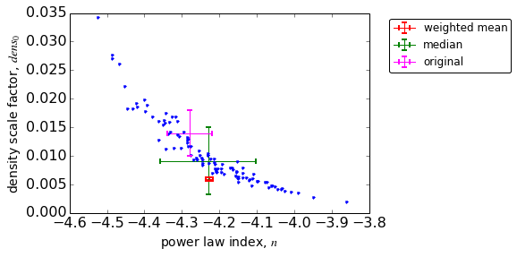

###Import libraries:###

    %matplotlib inline
    import matplotlib.pyplot as plt
    from matplotlib.font_manager import FontProperties
    fontP = FontProperties()
    fontP.set_size('small')

    /usr/lib64/python2.7/site-packages/matplotlib/__init__.py:758: UserWarning: Found matplotlib configuration in ~/.matplotlib/. To conform with the XDG base directory standard, this configuration location has been deprecated on Linux, and the new location is now '/home/piladiez/.config'/matplotlib/. Please move your configuration there to ensure that matplotlib will continue to find it in the future.
      _get_xdg_config_dir())

    import numpy as np

###Create a function that returns the weighted mean and its uncertainty:###

    def ponderada(xx,err_xx):
        err_xx2=np.power(err_xx,2)
        numerator=np.sum(np.divide(xx,err_xx2))
        denominator=np.sum(np.divide([1.]*len(err_xx),err_xx2))
        weighted_mean=numerator/denominator
        weighted_uncertainty=1/np.sqrt(denominator)
        return weighted_mean,weighted_uncertainty

### Import the data ###

* Best fit results from the Monte Carlo simulations:

    MCfile='/disks/shear7/piladiez/INT-ui/MonteCarlo_photomErrors/results/MonteCarlo_axisymmetricfits_headerTopcat.cat'
    chi2_red, dens0,E_dens0, n,E_n, q,E_q = np.loadtxt(MCfile, usecols=(2, 5,6,7,8,9,10),unpack=True)
    q=np.abs(q)

* Results from the best fits to the data in the paper:

    or_dens0,or_Edens0 = 0.0013,0.0004
    or_n,or_En = -4.28, 0.06
    or_q,or_Eq = 0.61,0.04
    or_red_chi2 = 1.9

### Analysis and comparison ###

* Density scale factor:

    Wdens0,WEdens0=ponderada(dens0,E_dens0)
    
    print 'Weighted mean:'
    print 'dens0=', '%s' % float('%.3g' % Wdens0), '+/-', '%s' % float('%.2g' % WEdens0)
    
    print ''
    print 'Median (+/-std):'
    print 'dens0=', '%s' % float('%.2g' % np.median(dens0)), '+/-', '%s' % float('%.2g' % np.std(E_dens0))
    
    print ''
    print 'Original result from paper:'
    print 'dens0=', '%s' % float('%.4g' % or_dens0), '+/-', '%s' % float('%.2g' %or_Edens0)

    Weighted mean:
    dens0= 0.00596 +/- 0.00027
    
    Median (+/-std):
    dens0= 0.0091 +/- 0.0024
    
    Original result from paper:
    dens0= 0.0013 +/- 0.0004

    plt.figure(num=1) # , figsize=(10,10)
    plt.tick_params(labelsize=14) 
    
    plt.xlabel('density scale factor, $dens_0$', fontsize=14)
    plt.ylabel('frequency', fontsize=14)
    
    plt.hist(dens0,bins=10)
    plt.axvline(Wdens0, color='r', linestyle='dashed', linewidth=2,label='weighted mean')
    plt.axvline(np.median(dens0), color='g', linestyle='dashed', linewidth=2,label='median')
    plt.axvline(or_dens0, color='magenta', linestyle='solid', linewidth=2,label='original')
    
    plt.legend(bbox_to_anchor=(1.05, 1), loc=2, borderaxespad=0.)
    #plt.legend(fancybox=True, loc='upper right', ncol=1, numpoints=1) # prop=fontP, 
    
    plt.show()

* Power law index:

    Wn,WEn=ponderada(n,E_n)
    print 'Weighted mean:'
    #print 'n=', '%s' % float('%.3g' % Wn), '+/-', '%s' % float('%.1g' % WEn)
    print 'n=', round(Wn,2), '+/-', round(WEn,2)
    
    print ''
    print 'Median (+/-std):'
    print 'n=', '%s' % float('%.3g' % np.median(n)), '+/-', '%s' % float('%.2g' % np.std(n))
    
    print ''
    print 'Original result from paper:'
    print 'n=', '%s' % float('%.4g' % or_n), '+/-', '%s' % float('%.2g' %or_En)

    Weighted mean:
    n= -4.23 +/- 0.01
    
    Median (+/-std):
    n= -4.23 +/- 0.13
    
    Original result from paper:
    n= -4.28 +/- 0.06

    plt.figure(num=2) # , figsize=(10,10)
    plt.tick_params(labelsize=16) 
    #plt.title('$\chi^2_{red}$ zoom map for $n_{in}$ and $R_{break}$')
    
    plt.xlabel('power law index, $n$', fontsize=14)
    plt.ylabel('frequency', fontsize=14)
    
    plt.hist(n,bins=12)
    plt.axvline(Wn, color='r', linestyle='dashed', linewidth=2,label='weighted mean')
    plt.axvline(np.median(n), color='g', linestyle='dashed', linewidth=2,label='median')
    plt.axvline(or_n, color='magenta', linestyle='solid', linewidth=2,label='original')
    
    plt.legend(bbox_to_anchor=(1.05, 1), loc=2, borderaxespad=0.)
    #plt.legend(fancybox=True, loc='upper right', ncol=1, numpoints=1) # prop=fontP, 
    
    plt.show()

* Oblateness:

    Wq,WEq=ponderada(q,E_q)
    
    print 'Weighted mean:'
    #print 'q=', '%s' % float('%.3g' % Wq), '+/-', '%s' % float('%.1g' % WEq)
    print 'q=', round(Wq,2), '+/-', round(WEq,2)
    
    print ''
    print 'Median (+/-std):'
    print 'q=', '%s' % float('%.3g' % np.median(q)), '+/-', '%s' % float('%.2g' % np.std(q))
    
    print ''
    print 'Original result from paper:'
    print 'q=', '%s' % float('%.4g' % or_q), '+/-', '%s' % float('%.2g' % or_Eq)

    Weighted mean:
    q= 0.65 +/- 0.01
    
    Median (+/-std):
    q= 0.672 +/- 0.067
    
    Original result from paper:
    q= 0.61 +/- 0.04

    plt.figure(num=3) # , figsize=(10,10)
    plt.tick_params(labelsize=14) 
    
    plt.xlabel('oblateness, $q$', fontsize=14)
    plt.ylabel('frequency', fontsize=14)
    
    plt.hist(q,bins=10)
    plt.axvline(Wq, color='r', linestyle='dashed', linewidth=2,label='weighted mean')
    plt.axvline(np.median(q), color='g', linestyle='dashed', linewidth=2,label='median')
    plt.axvline(or_q, color='magenta', linestyle='solid', linewidth=2,label='original')
    
    plt.legend(bbox_to_anchor=(1.05, 1), loc=2, borderaxespad=0.)
    #plt.legend(fancybox=True, loc='upper right', ncol=1, numpoints=1) # prop=fontP, 
    
    plt.show()

* Weight centre plots:

    plt.figure(num=4) # , figsize=(10,10)
    plt.tick_params(labelsize=16) 
    #plt.title('$\chi^2_{red}$ zoom map for $n_{in}$ and $R_{break}$')
    
    plt.xlabel('power law index, $n$', fontsize=14)
    plt.ylabel('density scale factor, $dens_0$', fontsize=14)
    
    #plt.scatter(n,dens0,'.')
    plt.plot(n,dens0,'.')
    plt.errorbar(Wn,Wdens0,xerr=WEn,yerr=WEdens0, 
                 color='r',ms=12,mew=2, label='weighted mean')
    plt.errorbar(np.median(n),np.median(dens0),xerr=np.std(n),yerr=np.std(dens0), 
                 color='green',ms=12,mew=2, label='median')
    plt.errorbar(or_n,or_dens0,xerr=or_En,yerr=or_Edens0, 
                 color='magenta',ms=12,mew=2, label='original')
    
    plt.legend(fancybox=True,bbox_to_anchor=(1.05, 1), numpoints=1,loc=2)#, borderaxespad=0.)
    #plt.legend(fancybox=True, loc='upper right', ncol=1, numpoints=1) # prop=fontP, 
    
    plt.show()

    plt.figure(num=5) # , figsize=(10,10)
    plt.tick_params(labelsize=16) 
    #plt.title('$\chi^2_{red}$ zoom map for $n_{in}$ and $R_{break}$')
    
    plt.xlabel('power law index, $n$', fontsize=14)
    plt.ylabel('oblateness, $q$', fontsize=14)
    
    #plt.scatter(n,dens0,'.')
    plt.plot(n,q,'.')
    plt.errorbar(Wn,Wq,xerr=WEn,yerr=WEq, 
             color='red',ms=12,mew=2, label='weighted mean')
    plt.errorbar(np.median(n),np.median(q),xerr=np.std(n),yerr=np.std(q), 
             color='green',ms=12,mew=2, label='median')
    plt.errorbar(or_n,or_q,xerr=or_En,yerr=or_Eq, 
                 color='magenta',ms=12,mew=2, label='original')
    
    plt.legend(fancybox=True,bbox_to_anchor=(1.05, 1), numpoints=1,loc=2)#, borderaxespad=0.)
    #plt.legend(fancybox=True, loc='lower right', ncol=1, numpoints=1) # prop=fontP, 
    
    plt.show()

### Conclusions ###

* The median is a better predictor for the distribution of the MC results than
the weighted mean.
* Expectedly, the standard deviation returns larger uncertainties than the
weighted errors. Thus the standard deviation accounts better for the influence
of the photometric errors.

* The $q$ and $n$ medians resulting of the MC simulations include the original
values in the paper within their uncertainties. This is not the case for the
$dens_0$ median.
* The uncertainties from the MC standard deviations can be used to increase the
uncertainties in the paper by considering them sistematic errors and combining
them with the statistic errors (best fit errors) through squares sum:
$E_{tot}= \sqrt{(E_{stat})^2+(E_{sist})^2}=
\sqrt{(E_{bestFit})^2+(E_{MCmedian})^2}$

* The results then should be centered in the median or in the original values?

### For reference ###

* The $chi^2_{red}$ of the MC simulation follow this distribution:

    plt.figure(num=6) # , figsize=(10,10)
    plt.tick_params(labelsize=14) 
    
    plt.xlabel('$chi^2_{red}$', fontsize=14)
    plt.ylabel('frequency', fontsize=14)
    
    
    plt.hist(chi2_red,bins=10)
    plt.axvline(np.median(chi2_red), color='g', linestyle='dashed', linewidth=2,label='median')
    plt.axvline(or_red_chi2, color='magenta', linestyle='solid', linewidth=2,label='original')
    
    plt.legend(fancybox=True, loc='upper right', ncol=1, numpoints=1) # prop=fontP, 
    
    plt.show()

    
