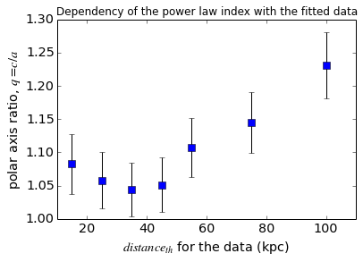
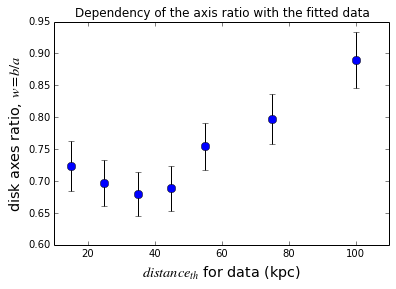

# Scope:

In this Notebook we are going to explore the dependency of the oblateness
($q=c/a$) and the disk axis ratio ($w=b/a$) with the amount of data provided for
model fitting. In particular, we are fitting a triaxial model and we are
removing those distance bins that sample known substructure in certain lines of
sights. To explore the dependency, we run the model fitting for data out to 15,
25, 35, 45, 55, 75 and 100 kpc. Along this Notebook we will only use data binned
in distance modulus units of 0.2 mag.

# Lets get started:

* First lets load some Python libraries:

    %matplotlib inline
    import numpy as np
    import matplotlib.pyplot as plt
    from matplotlib.font_manager import FontProperties
    fontP = FontProperties()
    fontP.set_size('small')

* Second lets call the file containg the output of the fittings, and load its
diferent columns as numpy vectors:

    fname='/disks/shear7/piladiez/INT-ui/evolution_triaxial_q_with_distthreshold.cat'
    distThr,red_chi2,N,n,err_n,q,err_q,w,err_w=f=np.loadtxt(fname,usecols=(0,2,3,7,8,9,10,11,12),unpack=True)

# Performance of the fittings:

* Now we will explore how the model fitting performs depending on the data
provided. For this we are plotting the reduced $\chi^2$ against the distance
threshold ($dist_{th}$) impossed to the data to be fitted.

    plt.figure(num=4)
    plt.title('Dependency of the reduced $\chi^2$ with the fitted data')
    plt.xlabel('$dist_{th}$ for the data (kpc)', fontsize='x-large')
    plt.ylabel('$reduced\, \chi^2$', fontsize='x-large')
    plt.plot(distThr,red_chi2,'go',ms=8)

    [<matplotlib.lines.Line2D at 0x6c2e550>]

We can see that the dependency is approximately linear out to 75 kpc but, for
the final fit out to 100kpc, we can see an exponential grow in the reduced
$\chi^2$. This means a significant worsening of the fit that increases with the
complexity of the data.

# Evolution of the oblateness:

* Next we are going to start addressing the dependency of the oblateness $q$
with the data available to be fitted:

    plt.figure(num=1)
    plt.title('Dependency of the oblateness with the fitted data')
    plt.tick_params(labelsize='x-large')
    plt.xlabel('$distance_{th}$ for the data (kpc)', fontsize='x-large')
    plt.ylabel('polar axis ratio, $q=c/a$', fontsize='x-large')
    plt.errorbar(distThr,q, yerr=err_q, 
                 color='b',ecolor='k',fmt='s',ms=8,label='oblateness')

    <Container object of 3 artists>

* And the dependency of the disk axes ratio $w$ to the fitted data:

    plt.figure(num=2)
    plt.title('Dependency of the axis ratio with the fitted data')
    plt.xlabel('$distance_{th}$ for data (kpc)', fontsize='x-large')
    plt.ylabel('disk axes ratio, $w=b/a$', fontsize='x-large')
    plt.errorbar(distThr,w, yerr=err_w, 
                 color='r',ecolor='k',fmt='s',ms=8,label='axes ratio')

    <Container object of 3 artists>

Both trends look very similar, as expected from the covariance matrices in each
fit. So lets plot both parameters against each other:

    plt.figure(num=3)
    plt.title('Disk axes ratio vs polar axes ratio (b/c)')
    plt.xlabel('polar axis ratio, $q=c/a$', fontsize='x-large')
    plt.ylabel('disk axis ratio,$ w=b/a$', fontsize='x-large')
    plt.plot(q,w,'go',ms=8)

    [<matplotlib.lines.Line2D at 0x8fa33d0>]

Conclusion 1: We can see that the relation between $q$ and $w$ is quasi linear,
being both parameters strongly correlated. This means that with the current data
and fitting algorithm we can not expect to reduce the oblateness without
reducing the disk axis ratio proportionally.

Conclusion2: Since the reduced $\chi^2$ is also proportional to the $dist_{th}$,
this indicates that the prefered fit happens for the smaller data set, the one
reaching out to 15 kpc. However this does not necessarily mean that those
parameters are the best representation of the halo, but that the halo is best
fit or more easily represented when smaller portions are considered.

Conclusion 3: The dependency of $q$ and $w$ seems to indicate a gradient in both
parameters with distance. However, since they are coupled together, it is also
possible that the parameters remain constant and the apparent gradient is a
mathematical artifact of the fitting procedure.

Conclusion 4: If the gradient is indeed a true feature, the change of trend in
the $q$ and $w$ values (the change in the gradient) at around 30-35 kpc, could
be indicating the famous break in the power law (currently accepted at 26-28
kpc).

Conclusion 5: The gradient is not enough to justify the difference between our
$q$ values and those in the literature ($0.7<q<0.9$). This means that either our
results are to be trusted as they are or that there is potentially a bias
influencing our zero point. This possible bias leads directly to the following
section, containg a few ideas for tests.

# Pending tests:

* Check if it is a specific line of sight the one that is making $q$ and $w$
different from the values in the literature.
* Fit models to halo stars without the additional g-i constraint (previous works
simply select in $0.2<g-r<0.3$), and see if the difference in the tracers is the
reason for the difference in $q$ and $w$.

    
