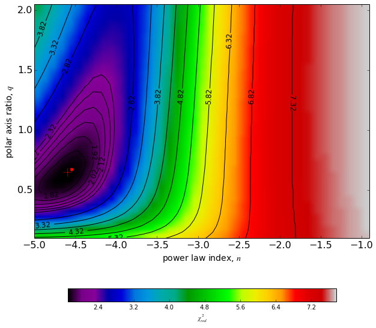

## Load libraries:

    %matplotlib inline
    import numpy as np
    import asciidata as asd

    /usr/lib64/python2.7/site-packages/matplotlib/__init__.py:758: UserWarning: Found matplotlib configuration in ~/.matplotlib/. To conform with the XDG base directory standard, this configuration location has been deprecated on Linux, and the new location is now '/home/piladiez/.config'/matplotlib/. Please move your configuration there to ensure that matplotlib will continue to find it in the future.
      _get_xdg_config_dir())

    import matplotlib.pyplot as plt
    from matplotlib.font_manager import FontProperties
    fontP = FontProperties()
    fontP.set_size('small')

## Load the data file and organize its columns into vectors:

    #file='/disks/shear7/piladiez/INT-ui/catalogues/fits/isocontours_simplebroken_chi2red_0.2DMbin.cat'
    file='/disks/shear7/piladiez/INT-ui/catalogues/fits/isocontours_axisymmetric_chi2red_0.4DMbin.cat'
    cat=asd.open(file)

    N=cat[0].tonumpy()
    Q=cat[1].tonumpy()
    CHI2=cat[2].tonumpy()
    RHO=cat[3].tonumpy()
    ERR_RHO=cat[4].tonumpy()

## Mapping the minimum $chi^2_{red}$ across a pair of grid parameters:

    from lib_frange import frange
    n_step,q_step=0.1,0.05
    RANGE_n=frange(-5,-0.95,n_step)
    RANGE_q=frange(0.1,2.04,q_step)
    print len(RANGE_n),len(RANGE_q)

    41 39

* Power law index ($n$) and polar axis ratio ($q$):

    ARRAY_chi2red_nq=np.zeros((len(RANGE_q),len(RANGE_n)))
    ARRAY_rho_nq=np.zeros((len(RANGE_q),len(RANGE_n)))
    ARRAY_Erho_nq=np.zeros((len(RANGE_q),len(RANGE_n)))
    LIST_q, LIST_n=[],[]
    
    Nn=0
    for n in RANGE_n:
        use_n = np.where(N==round(n,2))
        SUBSET_q= Q[use_n]
        SUBSET_n= N[use_n]
        SUBSET_chi2=CHI2[use_n]
        SUBSET_rho=RHO[use_n]
        SUBSET_err_rho=ERR_RHO[use_n]
        
        Nq=0
        for q in reversed(RANGE_q):
            use_q = np.where(SUBSET_q==round(q,2))
            SUBSET2_q= SUBSET_q[use_q]
            SUBSET2_n= SUBSET_n[use_q]
            SUBSET2_chi2=SUBSET_chi2[use_q]
            SUBSET2_rho=SUBSET_rho[use_q]
            SUBSET2_err_rho=SUBSET_err_rho[use_q]
            #print n,q,len(SUBSET2_chi2)
            ARRAY_chi2red_nq[Nq][Nn]=np.min(SUBSET2_chi2)
            ARRAY_rho_nq[Nq][Nn]=SUBSET2_rho[np.argmin(SUBSET2_chi2)]
            ARRAY_Erho_nq[Nq][Nn]=SUBSET2_err_rho[np.argmin(SUBSET2_chi2)]
            LIST_q.append(q)
            Nq=Nq+1
        LIST_n.append(n)
        Nn=Nn+1
    
    #print np.min(ARRAY_chi2red_nn),np.max(ARRAY_chi2red_nn)
    print 'Min =',np.min(ARRAY_chi2red_nq)#,np.max(ARRAY_chi2red_ninq)
    k,l = np.unravel_index(ARRAY_chi2red_nq.argmin(), ARRAY_chi2red_nq.shape)
    print 'at q=',LIST_q[k],', n=',LIST_n[l]
    #print np.shape(ARRAY_chi2red_nn)

    Min = 1.72
    at q= 0.65 , n= -4.6

    import matplotlib
    fontP.set_size('xx-small')
    
    from matplotlib.colors import LogNorm
    
    plt.figure(num=1, figsize=(10,10))
    plt.tick_params(labelsize=16) 
    #plt.title('$\chi^2_{red}$ map for $n$ and $q$')
    
    
    plt.xlabel('power law index, $n$', fontsize=14)
    plt.ylabel('polar axis ratio, $q$', fontsize=14)
    
    cmap = matplotlib.cm.spectral
    im=plt.imshow(ARRAY_chi2red_nq,extent=[min(RANGE_n),max(RANGE_n)+n_step,min(RANGE_q),max(RANGE_q)+q_step], 
                  aspect='auto',cmap=cmap)#, interpolation='nearest')#, norm=LogNorm()
                  #,aspect='auto')
    
    CS1 = plt.contour(ARRAY_chi2red_nq, levels=frange(np.min(ARRAY_chi2red_nq)+0.1, np.min(ARRAY_chi2red_nq)+0.7, 0.1), 
                     colors='black', #origin='lower',linewidths=2,
                     extent=[min(RANGE_n),max(RANGE_n)+n_step,max(RANGE_q)+q_step,min(RANGE_q)])
    plt.clabel(CS1, inline=1,fmt='%1.2f', fontsize=12)
    
    
    CS3 = plt.contour(ARRAY_chi2red_nq, levels=frange(np.min(ARRAY_chi2red_nq)+1.1, np.max(ARRAY_chi2red_nq), 0.5), 
                     colors='black', #origin='lower',linewidths=2,
                     extent=[min(RANGE_n),max(RANGE_n)+n_step,max(RANGE_q)+q_step,min(RANGE_q)])
    plt.clabel(CS3, inline=1,fmt='%1.2f', fontsize=12)
    
    # We can still add a colorbar for the image, too.
    CBI = plt.colorbar(im, orientation='horizontal', shrink=0.8, label='$\chi^2_{red}$')
    #CBI = plt.colorbar(im, orientation='horizontal', shrink=0.8)
    
    plt.plot(LIST_n[l],LIST_q[k],'r+',markersize=14)
    plt.plot(LIST_n[l]+n_step/2,LIST_q[k]+q_step/2,'r.',markersize=10)
    
    
    #ax = CBI.ax
    #text = ax.yaxis.label
    #font=matplotlib.font_manager.FontProperties(size=16)
    #text.set_font_properties(font)
    
    plt.show()

## Comparing the best fit parameters resulting from the minimum in the grid to the those resulting from a continues range of values:

    qlocus_chi2min = LIST_q[k]
    nlocus_chi2min = LIST_n[l]
    
    print 'Locus for the min(chi^2_red):'
    print 'q=',qlocus_chi2min,'pm',q_step/2,'  n=',nlocus_chi2min,'pm',n_step/2
    
    print 'with rho0=','%s' % float('%.2g' % ARRAY_rho_nq[k][l]),'pm','%s' % float('%.1g' % ARRAY_Erho_nq[k][l])
    print 'and chisquare_red=','%s' % float('%.4g' % np.min(ARRAY_chi2red_nq))

    Locus for the min(chi^2_red):
    q= 0.65 pm 0.025   n= -4.6 pm 0.05
    with rho0= 0.017 pm 0.001
    and chisquare_red= 1.72

This compares to the best fit returned by the non-grid script as follows:

The best fit found by the script returns:

$q=0.59 \pm 0.07$,  $n=-4.66 \pm 0.11$

with $\rho_0=0.024 \pm 0.012$

and $\chi^2_{red}=1.764$

*Which is in agreement with the grid results (the uncertainties are enough to
reconcile the best fit values with the best grid values, even without
considering the grid cells size). The difference in the $\chi^2_{red}$ is due to
the difference in the number of free parameters. Indeed if we calculate the one
of the best fit based on 1 free parameter ($rho_0$), we would get $1.713$, which
is smaller than that of the grid.*

    
