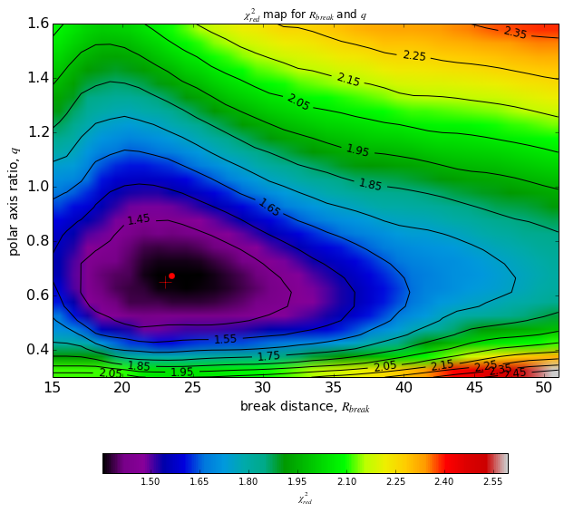
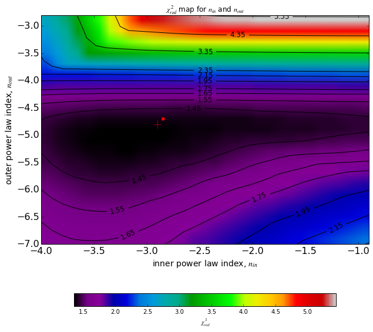
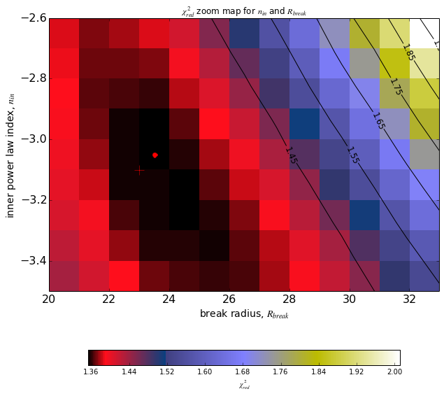

## Load libraries:

    %matplotlib inline
    import numpy as np
    import asciidata as asd

    /usr/lib64/python2.7/site-packages/matplotlib/__init__.py:758: UserWarning: Found matplotlib configuration in ~/.matplotlib/. To conform with the XDG base directory standard, this configuration location has been deprecated on Linux, and the new location is now '/home/piladiez/.config'/matplotlib/. Please move your configuration there to ensure that matplotlib will continue to find it in the future.
      _get_xdg_config_dir())

    import matplotlib.pyplot as plt
    from matplotlib.font_manager import FontProperties
    fontP = FontProperties()
    fontP.set_size('small')

## Load the data file and organize its columns into vectors:

    #file='/disks/shear7/piladiez/INT-ui/catalogues/fits/isocontours_simplebroken_chi2red_0.2DMbin.cat'
    file='/disks/shear7/piladiez/INT-ui/catalogues/fits/isocontours_simplebroken_chi2red_0.2DMbin.cat'
    cat=asd.open(file)

    R_BREAK=cat[0].tonumpy()
    Q=cat[1].tonumpy()
    N_IN=cat[2].tonumpy()
    N_OUT=cat[3].tonumpy()
    RHO=cat[4].tonumpy()
    ERR_RHO=cat[5].tonumpy()
    CHI2=cat[6].tonumpy()

## Mapping the minimum $chi^2_{red}$ across a pair of grid parameters:

    from lib_frange import frange
    nin_step,nout_step,q_step,R_step=0.1,0.2,0.05,1
    RANGE_nin=frange(-4,-0.9,nin_step)
    RANGE_nout=frange(-7,-2.9,nout_step)
    RANGE_q=frange(0.3,1.6,q_step)
    RANGE_Rbr=frange(15,51,R_step)
    print len(RANGE_nin),len(RANGE_nout),len(RANGE_q),len(RANGE_Rbr)

    31 21 26 36

* Break distance ($R_{break}$) and polar axis ratio ($q$):

    ARRAY_chi2red_qR=np.zeros((len(RANGE_q),len(RANGE_Rbr)))
    ARRAY_rho_qR=np.zeros((len(RANGE_q),len(RANGE_Rbr)))
    ARRAY_Erho_qR=np.zeros((len(RANGE_q),len(RANGE_Rbr)))
    LIST_R,LIST_q=[],[]
    
    NR=0
    for r_break in RANGE_Rbr:
        use_Rbr = np.where(R_BREAK==r_break)
        SUBSET_R_break=R_BREAK[use_Rbr]
        SUBSET_q= Q[use_Rbr]
        SUBSET_n_in= N_IN[use_Rbr]
        SUBSET_n_out= N_OUT[use_Rbr]
        SUBSET_chi2=CHI2[use_Rbr]
        SUBSET_rho=RHO[use_Rbr]
        SUBSET_err_rho=ERR_RHO[use_Rbr]
        #print SUBSET_q
        Nq=0
        for q in reversed(RANGE_q):
            #print q
            use_q = np.where(SUBSET_q==round(q,2))
            #print Nq,use_q, SUBSET_q[0]
            SUBSET2_R_break=SUBSET_R_break[use_q]
            SUBSET2_q= SUBSET_q[use_q]
            SUBSET2_n_in= SUBSET_n_in[use_q]
            SUBSET2_n_out= SUBSET_n_out[use_q]
            SUBSET2_chi2=SUBSET_chi2[use_q]
            SUBSET2_rho=SUBSET_rho[use_q]
            SUBSET2_err_rho=SUBSET_err_rho[use_q]
            #print SUBSET2_q
            #print ''
            
            ARRAY_chi2red_qR[Nq][NR]=np.min(SUBSET2_chi2)
            ARRAY_rho_qR[Nq][NR]=SUBSET2_rho[np.argmin(SUBSET2_chi2)]
            ARRAY_Erho_qR[Nq][NR]=SUBSET2_err_rho[np.argmin(SUBSET2_chi2)]
            LIST_q.append(q)
            Nq=Nq+1
        LIST_R.append(r_break)
        NR=NR+1
    
    #print np.min(ARRAY_chi2red_qR),np.max(ARRAY_chi2red_qR)
    print 'Min =',np.min(ARRAY_chi2red_qR)#,np.max(ARRAY_chi2red_ninq)
    i,j = np.unravel_index(ARRAY_chi2red_qR.argmin(), ARRAY_chi2red_qR.shape)
    print 'at q=',LIST_q[i],'and R_br=',LIST_R[j]#, ARRAY_chi2red_ninq[i][j]
    #print np.shape(ARRAY_chi2red_qR)
    print 'with rho0=',ARRAY_rho_qR[i][j],'pm',ARRAY_Erho_qR[i][j]
    print 'Max =',np.max(ARRAY_chi2red_qR)

    Min = 1.35326585213
    at q= 0.65 and R_br= 23.0
    with rho0= 0.0004375 pm 1.6e-05
    Max = 2.594547218

    import matplotlib
    fontP.set_size('xx-small')
    
    from matplotlib.colors import LogNorm
    
    plt.figure(num=1, figsize=(10,10))
    #ax = plt.subplot(111)
    #box = ax.get_position()
    #ax.set_position([box.x0, box.y0+0.08,box.width*1., box.height*1.])
    plt.tick_params(labelsize=16) 
    plt.title('$\chi^2_{red}$ map for $R_{break}$ and $q$')
    
    
    plt.xlabel('break distance, $R_{break}$', fontsize=14)
    plt.ylabel('polar axis ratio, $q$', fontsize=14)
    
    
    cmap = matplotlib.cm.spectral
    im=plt.imshow(ARRAY_chi2red_qR,extent=[min(RANGE_Rbr),max(RANGE_Rbr)+R_step,min(RANGE_q),max(RANGE_q)+q_step],
                  aspect='auto',cmap=cmap)#, interpolation='nearest')
    
    CS1 = plt.contour(ARRAY_chi2red_qR, levels=frange(np.min(ARRAY_chi2red_qR)+0.1, np.min(ARRAY_chi2red_qR)+1.1, 0.1), 
                     colors='black', #origin='lower',linewidths=2,
                     extent=[min(RANGE_Rbr),max(RANGE_Rbr)+R_step,max(RANGE_q)+q_step,min(RANGE_q)])
    plt.clabel(CS1, inline=1,fmt='%1.2f', fontsize=12)
    CS2 = plt.contour(ARRAY_chi2red_qR, levels=frange(np.min(ARRAY_chi2red_qR)+1.1, np.max(ARRAY_chi2red_qR), 0.2), 
                     colors='black', #origin='lower',linewidths=2,
                     extent=[min(RANGE_Rbr),max(RANGE_Rbr)+R_step,max(RANGE_q)+q_step,min(RANGE_q)])
    plt.clabel(CS2, inline=1,fmt='%1.2f', fontsize=12)
    
    plt.plot(LIST_R[j],LIST_q[i],'r+',markersize=14)
    plt.plot(LIST_R[j]+float(R_step)/2,LIST_q[i]+q_step/2,'r.',markersize=12)
    
    
    # We can still add a colorbar for the image, too.
    CBI = plt.colorbar(im, orientation='horizontal', shrink=0.8, label='$\chi^2_{red}$')
    
    plt.show()

* Power law indices ($n_{in}$ and $n_{out}$):

    ARRAY_chi2red_nn=np.zeros((len(RANGE_nout),len(RANGE_nin)))
    LIST_nout, LIST_nin=[],[]
    
    Nnin=0
    for n_in in RANGE_nin:
        use_nin = np.where(N_IN==round(n_in,2))
        SUBSET_R_break=R_BREAK[use_nin]
        SUBSET_q= Q[use_nin]
        SUBSET_n_in= N_IN[use_nin]
        SUBSET_n_out= N_OUT[use_nin]
        SUBSET_chi2=CHI2[use_nin]
        SUBSET_rho=RHO[use_nin]
        SUBSET_err_rho=ERR_RHO[use_nin]
        #print SUBSET_q
        Nnout=0
        for n_out in reversed(RANGE_nout):
            #print q
            use_nout = np.where(SUBSET_n_out==round(n_out,2))
            #print Nq,use_q, SUBSET_q[0]
            SUBSET2_R_break=SUBSET_R_break[use_nout]
            SUBSET2_q= SUBSET_q[use_nout]
            SUBSET2_n_in= SUBSET_n_in[use_nout]
            SUBSET2_n_out= SUBSET_n_out[use_nout]
            SUBSET2_chi2=SUBSET_chi2[use_nout]
            SUBSET2_rho=SUBSET_rho[use_nout]
            SUBSET2_err_rho=SUBSET_err_rho[use_nout]
            #print SUBSET2_q
            #print ''
            
            ARRAY_chi2red_nn[Nnout][Nnin]=np.min(SUBSET2_chi2)
            LIST_nout.append(n_out)
            Nnout=Nnout+1
        LIST_nin.append(n_in)
        Nnin=Nnin+1
    
    #print np.min(ARRAY_chi2red_nn),np.max(ARRAY_chi2red_nn)
    print 'Min =',np.min(ARRAY_chi2red_nn)#,np.max(ARRAY_chi2red_ninq)
    k,l = np.unravel_index(ARRAY_chi2red_nn.argmin(), ARRAY_chi2red_nn.shape)
    print 'at n_out=',LIST_nout[k],'and n_in=',LIST_nin[l]
    #print np.shape(ARRAY_chi2red_nn)

    Min = 1.35326585213
    at n_out= -5.2 and n_in= -3.1

    
    plt.figure(num=2, figsize=(10,10))
    plt.tick_params(labelsize=16) 
    plt.title('$\chi^2_{red}$ map for $n_{in}$ and $n_{out}$')
    
    
    plt.xlabel('inner power law index, $n_{in}$', fontsize=14)
    plt.ylabel('outer power law index, $n_{out}$', fontsize=14)
    
    cmap = matplotlib.cm.spectral
    im=plt.imshow(ARRAY_chi2red_nn,extent=[min(RANGE_nin),max(RANGE_nin)+nin_step,min(RANGE_nout),max(RANGE_nout)+nout_step], 
                  aspect='auto',cmap=cmap)#, interpolation='nearest')#, norm=LogNorm()
                  #,aspect='auto')
    
    CS1 = plt.contour(ARRAY_chi2red_nn, levels=frange(np.min(ARRAY_chi2red_nn)+0.1, np.min(ARRAY_chi2red_nn)+0.4, 0.1), 
                     colors='black', #origin='lower',linewidths=2,
                     extent=[min(RANGE_nin),max(RANGE_nin)+nin_step,max(RANGE_nout)+nout_step,min(RANGE_nout)])
    plt.clabel(CS1, inline=1,fmt='%1.2f', fontsize=12)
    
    CS2 = plt.contour(ARRAY_chi2red_nn, levels=frange(np.min(ARRAY_chi2red_nn)+0.4, np.min(ARRAY_chi2red_nn)+1.0, 0.2), 
                     colors='black', #origin='lower',linewidths=2,
                     extent=[min(RANGE_nin),max(RANGE_nin)+nin_step,max(RANGE_nout)+nout_step,min(RANGE_nout)])
    plt.clabel(CS2, inline=1,fmt='%1.2f', fontsize=12)
    
    CS3 = plt.contour(ARRAY_chi2red_nn, levels=frange(np.min(ARRAY_chi2red_nn)+1.0, np.max(ARRAY_chi2red_nn), 1.0), 
                     colors='black', #origin='lower',linewidths=2,
                     extent=[min(RANGE_nin),max(RANGE_nin)+nin_step,max(RANGE_nout)+nout_step,min(RANGE_nout)])
    plt.clabel(CS3, inline=1,fmt='%1.2f', fontsize=12)
    
    # We can still add a colorbar for the image, too.
    CBI = plt.colorbar(im, orientation='horizontal', shrink=0.8, label='$\chi^2_{red}$')
    #CBI = plt.colorbar(im, orientation='horizontal', shrink=0.8)
    
    plt.plot(LIST_nin[k],LIST_nout[l],'r+',markersize=14)
    plt.plot(LIST_nin[k]+nin_step/2,LIST_nout[l]+nout_step/2,'r.',markersize=10)
    
    
    #ax = CBI.ax
    #text = ax.yaxis.label
    #font=matplotlib.font_manager.FontProperties(size=16)
    #text.set_font_properties(font)
    
    plt.show()

* Inner power law index ($n_{in}$) and break radius ($R_{break}$), in zoom mode
for greater detail (they are the axes with the greatest degeneracy):

    ARRAY_chi2red_ninR=np.zeros((len(frange(-3.5,-2.6,nin_step)),len(frange(20,33,R_step))))
    RANGE_Rbr2=frange(20,33,R_step)
    RANGE_nin2=frange(-3.5,-2.6,nin_step)
    LIST_R2, LIST_nin2=[],[]
    
    NR=0
    for R in RANGE_Rbr:
        if round(R,2) <= 32 and round(R,2) >= 20:
            use_R = np.where(R_BREAK==round(R,2))
            SUBSET_R_break=R_BREAK[use_R]
            SUBSET_q= Q[use_R]
            SUBSET_n_in= N_IN[use_R]
            SUBSET_n_out= N_OUT[use_R]
            SUBSET_chi2=CHI2[use_R]
            SUBSET_rho=RHO[use_R]
            SUBSET_err_rho=ERR_RHO[use_R]
            
            Nnin=0
            for n_in in reversed(RANGE_nin):
                if round(n_in,2) <= -2.7 and round(n_in,2) >= -3.5:
                    use_nin = np.where(SUBSET_n_in==round(n_in,2))
                    SUBSET2_R_break=SUBSET_R_break[use_nin]
                    SUBSET2_q= SUBSET_q[use_nin]
                    SUBSET2_n_in= SUBSET_n_in[use_nin]
                    SUBSET2_n_out= SUBSET_n_out[use_nin]
                    SUBSET2_chi2=SUBSET_chi2[use_nin]
                    SUBSET2_rho=SUBSET_rho[use_nin]
                    SUBSET2_err_rho=SUBSET_err_rho[use_nin]
                    
                    ARRAY_chi2red_ninR[Nnin][NR]=np.min(SUBSET2_chi2)
                    LIST_nin2.append(n_in)
                    Nnin=Nnin+1
            LIST_R2.append(R)
            NR=NR+1
    
    print 'Min =',np.min(ARRAY_chi2red_ninR)#,np.max(ARRAY_chi2red_ninq)
    a,b = np.unravel_index(ARRAY_chi2red_ninR.argmin(), ARRAY_chi2red_ninR.shape)
    print 'at R=',LIST_R2[b],'and n_in=',LIST_nin2[a]#, ARRAY_chi2red_ninq[i][j]
    #print ARRAY_chi2red_ninq
    #print np.shape(ARRAY_chi2red_ninq)

    Min = 1.35326585213
    at R= 23.0 and n_in= -3.1

    
    plt.figure(num=3, figsize=(10,10))
    plt.tick_params(labelsize=16) 
    plt.title('$\chi^2_{red}$ zoom map for $n_{in}$ and $R_{break}$')
    
    plt.xlabel('break radius, $R_{break}$', fontsize=14)
    plt.ylabel('inner power law index, $n_{in}$', fontsize=14)
    
    cmap = matplotlib.cm.gist_stern
    im=plt.imshow(ARRAY_chi2red_ninR,extent=[min(RANGE_Rbr2),max(RANGE_Rbr2)+R_step,min(RANGE_nin2),max(RANGE_nin2)+nin_step], 
                  aspect='auto',cmap=cmap, interpolation='nearest')#, norm=LogNorm())
                  #,cmap=cmap,aspect='auto')
        
    CS1 = plt.contour(ARRAY_chi2red_ninR, levels=frange(np.min(ARRAY_chi2red_ninR)+0.1, np.max(ARRAY_chi2red_ninR), 0.1), 
                     colors='black', #origin='lower',linewidths=2,
                     extent=[min(RANGE_Rbr2),max(RANGE_Rbr2)+R_step,max(RANGE_nin2)+nin_step,min(RANGE_nin2)])
    plt.clabel(CS1, inline=1,fmt='%1.2f', fontsize=12)
    
    
    # We can still add a colorbar for the image, too.
    CBI = plt.colorbar(im, orientation='horizontal', shrink=0.8, label='$\chi^2_{red}$')
    
    plt.plot(LIST_R2[b],LIST_nin2[a],'r+',markersize=14)
    plt.plot(LIST_R2[b]+float(R_step)/2,LIST_nin2[a]+nin_step/2,'r.',markersize=14)
    
    #ax = CBI.ax
    #text = ax.yaxis.label
    #font=matplotlib.font_manager.FontProperties(size=16)
    #text.set_font_properties(font)
    
    plt.show()

## Comparing the best fit parameters resulting from the minimum in the grid to the those resulting from a continues range of values:

    qlocus_chi2min = LIST_q[i]
    Rlocus_chi2min = LIST_R[j]
    noutlocus_chi2min = LIST_nout[k]
    ninlocus_chi2min = LIST_nin[l]
    print 'Locus for the min(chi^2_red):'
    print 'q=',qlocus_chi2min,'pm',q_step/2,'  R_break=',Rlocus_chi2min,'pm',float(R_step)/2,'  n_in=',ninlocus_chi2min,'pm',nin_step/2,'  n_out=',noutlocus_chi2min,'pm',nout_step/2
    
    print 'with rho0=','%s' % float('%.2g' % ARRAY_rho_qR[i][j]),'pm','%s' % float('%.1g' % ARRAY_Erho_qR[i][j])
    print 'and chisquare_red=','%s' % float('%.4g' % np.min(ARRAY_chi2red_nn))

    Locus for the min(chi^2_red):
    q= 0.65 pm 0.025   R_break= 23.0 pm 0.5   n_in= -3.1 pm 0.05   n_out= -5.2 pm 0.1
    with rho0= 0.00044 pm 2e-05
    and chisquare_red= 1.353

This compares to the best fit returned by the non-grid script as follows:

The best fit found by the script returns:

$q=0.59 \pm 0.04$,  $R_{break}=20 \pm 1$,  $n_{in}=-2.54 \pm 0.5$  $n_{out}=-4.9
\pm 0.1$

with $\rho_0=(0.11 \pm 0.15) \cdot 10^{-3}$

and $\chi^2_{red}=1.418$

*Which is quite close but does not exactly match: in the cases of $q$ and
$n_{in}$ the uncertainties are enough to reconcile the best fit values with the
best grid values, considering the grid cells size. However in the cases of
$R_{break}$ and $n_{out}$ the uncertanties and grid steps are nearly enough but
not quite. The difference in the $\chi^2_{red}$ can mostly be explained by the
difference in number of free parameters. Indeed if we calculate the one of the
best fit based on 1 free parameters, we would get $1.378$, which is much closer
to the one from the grid.*

## Checking for a secondary minimum:

We fix the pair of grid parameters at the locus of their minimum $\chi^2_{red}$
($q=0.65$ and $R_{br}=23\, kpc$) and map the remaining $chi^2_{red}$ matrix for
the other pair of grid parameters ($n_{in}$ and $n_{out}$).

This step could be necessary in case there were more than 1 local minima with
very similar $\chi^2_{red}$, and the ($q$,$R_{break}$) locus of one minimum
could be confused with the ($n_{in}$,$n_{out}$) locus of the other one. This is
so far not the case, and that is why we recover the same values of
$n_{in}$,$n_{out}$ as before.

    ARRAY_chi2red_noutnin=np.zeros((len(RANGE_nout),len(RANGE_nin)))
    LIST_nin3, LIST_nout3=[],[]
    #print np.shape(ARRAY_chi2red_noutnin)
    
    use_min=np.where(R_BREAK==round(Rlocus_chi2min,2))
    SUBSET_R_break=R_BREAK[use_min]
    SUBSET_q= Q[use_min]
    SUBSET_n_in= N_IN[use_min]
    SUBSET_n_out= N_OUT[use_min]
    SUBSET_chi2=CHI2[use_min]
    SUBSET_rho=RHO[use_min]
    SUBSET_err_rho=ERR_RHO[use_min]
    
    use_min = np.where(SUBSET_q==round(qlocus_chi2min,2))
    SUBSET_R_break=SUBSET_R_break[use_min]
    SUBSET_q= SUBSET_q[use_min]
    SUBSET_n_in= SUBSET_n_in[use_min]
    SUBSET_n_out= SUBSET_n_out[use_min]
    SUBSET_chi2=SUBSET_chi2[use_min]
    SUBSET_rho=SUBSET_rho[use_min]
    SUBSET_err_rho=SUBSET_err_rho[use_min]
    
    #print len(SUBSET_q)
    
    Nnin=0
    for n_in in RANGE_nin:
        use_nin = np.where(SUBSET_n_in==round(n_in,2))
        SUBSET2_R_break=SUBSET_R_break[use_nin]
        SUBSET2_q= SUBSET_q[use_nin]
        SUBSET2_n_in= SUBSET_n_in[use_nin]
        SUBSET2_n_out= SUBSET_n_out[use_nin]
        SUBSET2_chi2=SUBSET_chi2[use_nin]
        SUBSET2_rho=SUBSET_rho[use_nin]
        SUBSET2_err_rho=SUBSET_err_rho[use_nin]
        #print SUBSET2_n_out
        #print len(SUBSET2_q)
        Nnout=0
        for n_out in reversed(RANGE_nout):
            use_nout = np.where(SUBSET2_n_out==round(n_out,2))
            SUBSET3_R_break=SUBSET2_R_break[use_nout]
            SUBSET3_q= SUBSET2_q[use_nout]
            SUBSET3_n_in= SUBSET2_n_in[use_nout]
            SUBSET3_n_out= SUBSET2_n_out[use_nout]
            SUBSET3_chi2=SUBSET2_chi2[use_nout]
            SUBSET3_rho=SUBSET2_rho[use_nout]
            SUBSET3_err_rho=SUBSET2_err_rho[use_nout]
            #print SUBSET2_q
            #print ''
            #print Nnout,Nnin,SUBSET3_chi2[0]
            ARRAY_chi2red_noutnin[Nnout][Nnin]=SUBSET3_chi2[0]
            LIST_nout.append(n_out)
            Nnout=Nnout+1
        LIST_nin.append(n_in)
        Nnin=Nnin+1
    
    #print np.min(ARRAY_chi2red_nn),np.max(ARRAY_chi2red_nn)
    print 'Second time locus:'
    print 'Min =',np.min(ARRAY_chi2red_noutnin)#,np.max(ARRAY_chi2red_ninq)
    c,d = np.unravel_index(ARRAY_chi2red_noutnin.argmin(), ARRAY_chi2red_noutnin.shape)
    print 'at n_out=',LIST_nout[c],'and n_in=',LIST_nin[d]
    #print 'Max =',np.max(ARRAY_chi2red_noutnin)
    print ''
    if float(LIST_nout[c])==float(noutlocus_chi2min) and float(LIST_nin[d])==float(ninlocus_chi2min):
        print 'The grid does not suggest a secondary minimum with equal minimum value.'
    else:
        print 'The values do not agree. This suggests a possible secondary minimum.'

    Second time locus:
    Min = 1.35326585213
    at n_out= -5.2 and n_in= -3.1
    
    The grid does not suggest a secondary minimum with equal minimum value.

